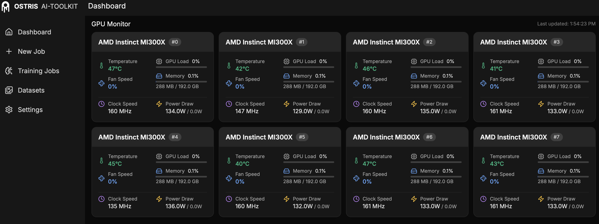

# AI-Toolkit with AMD MI300X GPUs

## Set up and Installations

### Clone the Repo
```bash
git clone git@github.com:dheyoai/ai-toolkit.git
```

### Switch to AMD branch
```bash
git checkout dheyo_amd
```

### Create and Activate Virtual Environment

```bash
python3 -m venv aitool
source aitool/bin/activate
```

### Install pytorch

```bash
uv pip install --pre torch torchvision torchaudio --index-url https://download.pytorch.org/whl/nightly/rocm6.4
```

### Install Other Dependencies

```bash
pip install -r requirements.txt
```

## CLI Launch
```bash
python3 run.py <path/to/config/yaml>
```

## GUI Launch

```bash
cd ui
npm run build_and_start
```

Open localhost/loopback URL on port 7777 on the browser
```
http://localhost:7777/
```

**Note**: Make sure to use SSH Tunneling when using gpu-22 or gpu-60 
```bash
ssh -L 7777:localhost:7777 ubuntu@gpu-22
```

## MI300X Monitoring Dashboard



## A Lazy Fix

If you are using the latest version of transformers (eg., 4.54.0.dev0), use the below hacky way to fix a bug related to Qwen Image.

In `<venv>/lib/python3.10/site-packages/transformers/configuration_utils.py` add a line in `get_text_config()` function to prevent qwen_image experiments from failing.

```python
    def get_text_config(self, decoder=False) -> "PretrainedConfig":
        """
        Returns the config that is meant to be used with text IO. On most models, it is the original config instance
        itself. On specific composite models, it is under a set of valid names.

        Args:
            decoder (`Optional[bool]`, *optional*, defaults to `False`):
                If set to `True`, then only search for decoder config names.
        """
        decoder_possible_text_config_names = ("decoder", "generator", "text_config")
        encoder_possible_text_config_names = ("text_encoder",)
        if decoder:
            possible_text_config_names = decoder_possible_text_config_names
        else:
            possible_text_config_names = encoder_possible_text_config_names + decoder_possible_text_config_names

        valid_text_config_names = []
        for text_config_name in possible_text_config_names:
            if hasattr(self, text_config_name):
                text_config = getattr(self, text_config_name, None)
                if text_config is not None:
                    valid_text_config_names += [text_config_name]

        if len(valid_text_config_names) > 1:
            raise ValueError(
                f"Multiple valid text configs were found in the model config: {valid_text_config_names}. In this "
                "case, using `get_text_config()` would be ambiguous. Please specify the desied text config directly."
            )
        elif len(valid_text_config_names) == 1:
            config_to_return = getattr(self, valid_text_config_names[0])
            config_to_return = PretrainedConfig.from_dict(config_to_return) ### 👈 add this line 
        else:
            config_to_return = self
        return config_to_return
```


## Notes

Support for the following features has been disabled temporarily 
- Quantization of DiT/Text Encoder with Torchao
- 8-bit Optimizer Quantization using bitsandbytes

Therefore, you cannot use quantization on AMD GPUs for now. 