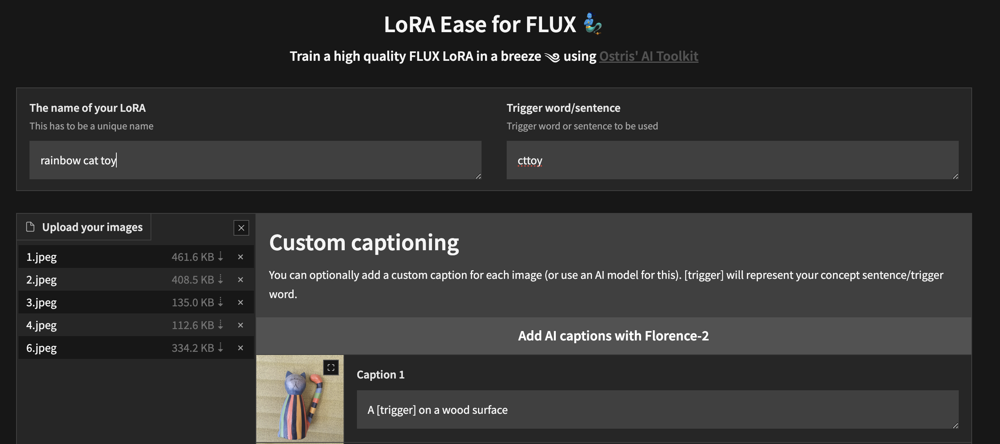

# AI Toolkit by Ostris

## Support My Work

If you enjoy my work, or use it for commercial purposes, please consider sponsoring me so I can continue to maintain it. Every bit helps! 

[Become a sponsor on GitHub](https://github.com/orgs/ostris) or [support me on Patreon](https://www.patreon.com/ostris).

Thank you to all my current supporters!

_Last updated: 2025-04-04_

### GitHub Sponsors

<a href="https://github.com/josephrocca" title="josephrocca"></a> <a href="https://github.com/replicate" title="Replicate"></a> <a href="https://github.com/weights-ai" title="Weights"></a> 

### Patreon Supporters

<a href="None" title="Aaron Amortegui"></a> <a href="None" title="Abraham Irawan"></a> <a href="None" title="Al H"></a> <a href="None" title="Albert Bukoski"></a> <a href="None" title="Armin Behjati"></a> <a href="None" title="Arvin Flores"></a> <a href="None" title="Austin Robinson"></a> <a href="None" title="Ben Ward"></a> <a href="None" title="Bharat Prabhakar"></a> <a href="None" title="Bnp"></a> <a href="None" title="clement Delangue"></a> <a href="None" title="Cosmosis"></a> <a href="None" title="David Garrido"></a> <a href="None" title="Doron Adler"></a> <a href="None" title="Eli Slugworth"></a> <a href="None" title="EmmanuelMr18"></a> <a href="None" title="Fagem X"></a> <a href="None" title="George Gostyshev"></a> <a href="None" title="Gili Ben Shahar"></a> <a href="None" title="HestoySeghuro ."></a> <a href="None" title="Jack Blakely"></a> <a href="None" title="Jack English"></a> <a href="None" title="Jason"></a> <a href="None" title="Jean-Tristan Marin"></a> <a href="None" title="Jodh Singh"></a> <a href="None" title="John Dopamine"></a> <a href="None" title="Joseph Rocca"></a> <a href="None" title="Julian Tsependa"></a> <a href="None" title="Kasım Açıkbaş"></a> <a href="None" title="Kelevra"></a> <a href="None" title="Kristjan Retter"></a> <a href="None" title="L D"></a> <a href="None" title="Lukas"></a> <a href="None" title="Marko jak"></a> <a href="None" title="Michael Levine"></a> <a href="None" title="Miguel Lara"></a> <a href="None" title="Misch Strotz"></a> <a href="None" title="Mohamed Oumoumad"></a> <a href="None" title="nitish PNR"></a> <a href="None" title="Noctre"></a> <a href="None" title="Patron"></a> <a href="None" title="Plaidam"></a> <a href="None" title="Prasanth Veerina"></a> <a href="None" title="RayHell"></a> <a href="None" title="Steve Hanff"></a> <a href="None" title="Steven Simmons"></a> <a href="None" title="Sören "></a> <a href="None" title="the biitz"></a> <a href="None" title="The Local Lab"></a> <a href="None" title="Trent Hunter"></a> <a href="None" title="Ultimate Golf Archives"></a> <a href="None" title="Un Defined"></a> <a href="None" title="Vladimir Sotnikov"></a> <a href="None" title="Wesley Reitzfeld"></a> <a href="None" title="william tatum"></a> <a href="None" title="Zack Abrams"></a> <a href="None" title="Zoltán-Csaba Nyiró"></a> <a href="None" title="Алексей Наумов"></a> <a href="None" title="עומר מכלוף"></a> 


---


## Installation

Requirements:
- python >3.10
- Nvidia GPU with enough ram to do what you need
- python venv
- git


Linux:
```bash
git clone https://github.com/ostris/ai-toolkit.git
cd ai-toolkit
python3 -m venv venv
source venv/bin/activate
# install torch first
pip3 install --no-cache-dir torch==2.6.0 torchvision==0.21.0 --index-url https://download.pytorch.org/whl/cu126
pip3 install -r requirements.txt
```

Windows:
```bash
git clone https://github.com/ostris/ai-toolkit.git
cd ai-toolkit
python -m venv venv
.\venv\Scripts\activate
pip install --no-cache-dir torch==2.6.0 torchvision==0.21.0 --index-url https://download.pytorch.org/whl/cu126
pip install -r requirements.txt
```


# AI Toolkit UI


The AI Toolkit UI is a web interface for the AI Toolkit. It allows you to easily start, stop, and monitor jobs. It also allows you to easily train models with a few clicks. It also allows you to set a token for the UI to prevent unauthorized access so it is mostly safe to run on an exposed server.

## Running the UI

Requirements:
- Node.js > 18

The UI does not need to be kept running for the jobs to run. It is only needed to start/stop/monitor jobs. The commands below
will install / update the UI and it's dependencies and start the UI. 

```bash
cd ui
npm run build_and_start
```

You can now access the UI at `http://localhost:8675` or `http://<your-ip>:8675` if you are running it on a server.

## Securing the UI

If you are hosting the UI on a cloud provider or any network that is not secure, I highly recommend securing it with an auth token. 
You can do this by setting the environment variable `AI_TOOLKIT_AUTH` to super secure password. This token will be required to access
the UI. You can set this when starting the UI like so:

```bash
# Linux
AI_TOOLKIT_AUTH=super_secure_password npm run build_and_start

# Windows
set AI_TOOLKIT_AUTH=super_secure_password && npm run build_and_start

# Windows Powershell
$env:AI_TOOLKIT_AUTH="super_secure_password"; npm run build_and_start
```


## FLUX.1 Training

### Tutorial

To get started quickly, check out [@araminta_k](https://x.com/araminta_k) tutorial on [Finetuning Flux Dev on a 3090](https://www.youtube.com/watch?v=HzGW_Kyermg) with 24GB VRAM.


### Requirements
You currently need a GPU with **at least 24GB of VRAM** to train FLUX.1. If you are using it as your GPU to control 
your monitors, you probably need to set the flag `low_vram: true` in the config file under `model:`. This will quantize
the model on CPU and should allow it to train with monitors attached. Users have gotten it to work on Windows with WSL,
but there are some reports of a bug when running on windows natively. 
I have only tested on linux for now. This is still extremely experimental
and a lot of quantizing and tricks had to happen to get it to fit on 24GB at all. 

### FLUX.1-dev

FLUX.1-dev has a non-commercial license. Which means anything you train will inherit the
non-commercial license. It is also a gated model, so you need to accept the license on HF before using it.
Otherwise, this will fail. Here are the required steps to setup a license.

1. Sign into HF and accept the model access here [black-forest-labs/FLUX.1-dev](https://huggingface.co/black-forest-labs/FLUX.1-dev)
2. Make a file named `.env` in the root on this folder
3. [Get a READ key from huggingface](https://huggingface.co/settings/tokens/new?) and add it to the `.env` file like so `HF_TOKEN=your_key_here`

### FLUX.1-schnell

FLUX.1-schnell is Apache 2.0. Anything trained on it can be licensed however you want and it does not require a HF_TOKEN to train.
However, it does require a special adapter to train with it, [ostris/FLUX.1-schnell-training-adapter](https://huggingface.co/ostris/FLUX.1-schnell-training-adapter).
It is also highly experimental. For best overall quality, training on FLUX.1-dev is recommended.

To use it, You just need to add the assistant to the `model` section of your config file like so:

```yaml
      model:
        name_or_path: "black-forest-labs/FLUX.1-schnell"
        assistant_lora_path: "ostris/FLUX.1-schnell-training-adapter"
        is_flux: true
        quantize: true
```

You also need to adjust your sample steps since schnell does not require as many

```yaml
      sample:
        guidance_scale: 1  # schnell does not do guidance
        sample_steps: 4  # 1 - 4 works well
```

### Training
1. Copy the example config file located at `config/examples/train_lora_flux_24gb.yaml` (`config/examples/train_lora_flux_schnell_24gb.yaml` for schnell) to the `config` folder and rename it to `whatever_you_want.yml`
2. Edit the file following the comments in the file
3. Run the file like so `python run.py config/whatever_you_want.yml`

A folder with the name and the training folder from the config file will be created when you start. It will have all 
checkpoints and images in it. You can stop the training at any time using ctrl+c and when you resume, it will pick back up
from the last checkpoint.

IMPORTANT. If you press crtl+c while it is saving, it will likely corrupt that checkpoint. So wait until it is done saving

### Need help?

Please do not open a bug report unless it is a bug in the code. You are welcome to [Join my Discord](https://discord.gg/VXmU2f5WEU)
and ask for help there. However, please refrain from PMing me directly with general question or support. Ask in the discord
and I will answer when I can.

## Gradio UI

To get started training locally with a with a custom UI, once you followed the steps above and `ai-toolkit` is installed:

```bash
cd ai-toolkit #in case you are not yet in the ai-toolkit folder
huggingface-cli login #provide a `write` token to publish your LoRA at the end
python flux_train_ui.py
```

You will instantiate a UI that will let you upload your images, caption them, train and publish your LoRA



## Training in RunPod
Example RunPod template: **runpod/pytorch:2.2.0-py3.10-cuda12.1.1-devel-ubuntu22.04**
> You need a minimum of 24GB VRAM, pick a GPU by your preference.

#### Example config ($0.5/hr):
- 1x A40 (48 GB VRAM)
- 19 vCPU 100 GB RAM

#### Custom overrides (you need some storage to clone FLUX.1, store datasets, store trained models and samples):
- ~120 GB Disk
- ~120 GB Pod Volume
- Start Jupyter Notebook

### 1. Setup
```
git clone https://github.com/ostris/ai-toolkit.git
cd ai-toolkit
git submodule update --init --recursive
python -m venv venv
source venv/bin/activate
pip install torch
pip install -r requirements.txt
pip install --upgrade accelerate transformers diffusers huggingface_hub #Optional, run it if you run into issues
```
### 2. Upload your dataset
- Create a new folder in the root, name it `dataset` or whatever you like.
- Drag and drop your .jpg, .jpeg, or .png images and .txt files inside the newly created dataset folder.

### 3. Login into Hugging Face with an Access Token
- Get a READ token from [here](https://huggingface.co/settings/tokens) and request access to Flux.1-dev model from [here](https://huggingface.co/black-forest-labs/FLUX.1-dev).
- Run ```huggingface-cli login``` and paste your token.

### 4. Training
- Copy an example config file located at ```config/examples``` to the config folder and rename it to ```whatever_you_want.yml```.
- Edit the config following the comments in the file.
- Change ```folder_path: "/path/to/images/folder"``` to your dataset path like ```folder_path: "/workspace/ai-toolkit/your-dataset"```.
- Run the file: ```python run.py config/whatever_you_want.yml```.

### Screenshot from RunPod


## Training in Modal

### 1. Setup
#### ai-toolkit:
```
git clone https://github.com/ostris/ai-toolkit.git
cd ai-toolkit
git submodule update --init --recursive
python -m venv venv
source venv/bin/activate
pip install torch
pip install -r requirements.txt
pip install --upgrade accelerate transformers diffusers huggingface_hub #Optional, run it if you run into issues
```
#### Modal:
- Run `pip install modal` to install the modal Python package.
- Run `modal setup` to authenticate (if this doesn’t work, try `python -m modal setup`).

#### Hugging Face:
- Get a READ token from [here](https://huggingface.co/settings/tokens) and request access to Flux.1-dev model from [here](https://huggingface.co/black-forest-labs/FLUX.1-dev).
- Run `huggingface-cli login` and paste your token.

### 2. Upload your dataset
- Drag and drop your dataset folder containing the .jpg, .jpeg, or .png images and .txt files in `ai-toolkit`.

### 3. Configs
- Copy an example config file located at ```config/examples/modal``` to the `config` folder and rename it to ```whatever_you_want.yml```.
- Edit the config following the comments in the file, **<ins>be careful and follow the example `/root/ai-toolkit` paths</ins>**.

### 4. Edit run_modal.py
- Set your entire local `ai-toolkit` path at `code_mount = modal.Mount.from_local_dir` like:
  
   ```
   code_mount = modal.Mount.from_local_dir("/Users/username/ai-toolkit", remote_path="/root/ai-toolkit")
   ```
- Choose a `GPU` and `Timeout` in `@app.function` _(default is A100 40GB and 2 hour timeout)_.

### 5. Training
- Run the config file in your terminal: `modal run run_modal.py --config-file-list-str=/root/ai-toolkit/config/whatever_you_want.yml`.
- You can monitor your training in your local terminal, or on [modal.com](https://modal.com/).
- Models, samples and optimizer will be stored in `Storage > flux-lora-models`.

### 6. Saving the model
- Check contents of the volume by running `modal volume ls flux-lora-models`. 
- Download the content by running `modal volume get flux-lora-models your-model-name`.
- Example: `modal volume get flux-lora-models my_first_flux_lora_v1`.

### Screenshot from Modal


---

## Dataset Preparation

Datasets generally need to be a folder containing images and associated text files. Currently, the only supported
formats are jpg, jpeg, and png. Webp currently has issues. The text files should be named the same as the images
but with a `.txt` extension. For example `image2.jpg` and `image2.txt`. The text file should contain only the caption.
You can add the word `[trigger]` in the caption file and if you have `trigger_word` in your config, it will be automatically
replaced. 

Images are never upscaled but they are downscaled and placed in buckets for batching. **You do not need to crop/resize your images**.
The loader will automatically resize them and can handle varying aspect ratios. 


## Training Specific Layers

To train specific layers with LoRA, you can use the `only_if_contains` network kwargs. For instance, if you want to train only the 2 layers
used by The Last Ben, [mentioned in this post](https://x.com/__TheBen/status/1829554120270987740), you can adjust your
network kwargs like so:

```yaml
      network:
        type: "lora"
        linear: 128
        linear_alpha: 128
        network_kwargs:
          only_if_contains:
            - "transformer.single_transformer_blocks.7.proj_out"
            - "transformer.single_transformer_blocks.20.proj_out"
```

The naming conventions of the layers are in diffusers format, so checking the state dict of a model will reveal 
the suffix of the name of the layers you want to train. You can also use this method to only train specific groups of weights.
For instance to only train the `single_transformer` for FLUX.1, you can use the following:

```yaml
      network:
        type: "lora"
        linear: 128
        linear_alpha: 128
        network_kwargs:
          only_if_contains:
            - "transformer.single_transformer_blocks."
```

You can also exclude layers by their names by using `ignore_if_contains` network kwarg. So to exclude all the single transformer blocks,


```yaml
      network:
        type: "lora"
        linear: 128
        linear_alpha: 128
        network_kwargs:
          ignore_if_contains:
            - "transformer.single_transformer_blocks."
```

`ignore_if_contains` takes priority over `only_if_contains`. So if a weight is covered by both,
if will be ignored.

## LoKr Training

To learn more about LoKr, read more about it at [KohakuBlueleaf/LyCORIS](https://github.com/KohakuBlueleaf/LyCORIS/blob/main/docs/Guidelines.md). To train a LoKr model, you can adjust the network type in the config file like so:

```yaml
      network:
        type: "lokr"
        lokr_full_rank: true
        lokr_factor: 8
```

Everything else should work the same including layer targeting.

