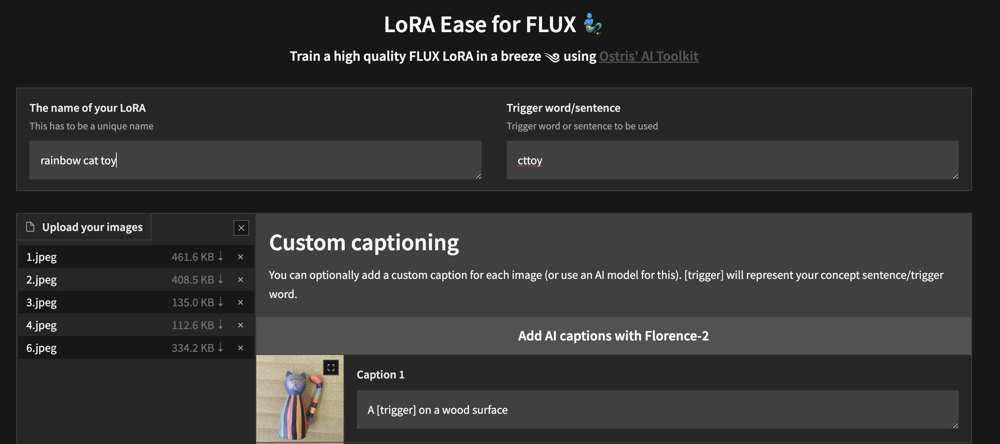

# Ostris AI Toolkit

AI Toolkit is an easy to use all in one training suite for diffusion models. I try to support all the latest models on consumer grade hardware. Image and video models. It can be run as a GUI or CLI. It is designed to be easy to use but still have every feature imaginable. Free and open source.


## Supported Models

### Image
- [black-forest-labs/FLUX.1-dev](https://huggingface.co/black-forest-labs/FLUX.1-dev) (FLUX.1)
- [black-forest-labs/FLUX.2-dev](https://huggingface.co/black-forest-labs/FLUX.2-dev) (FLUX.2)
- [black-forest-labs/FLUX.2-klein-base-4B](https://huggingface.co/black-forest-labs/FLUX.2-klein-base-4B) (FLUX.2-klein-base-4B)
- [black-forest-labs/FLUX.2-klein-base-9B](https://huggingface.co/black-forest-labs/FLUX.2-klein-base-9B) (FLUX.2-klein-base-9B)
- [ostris/Flex.1-alpha](https://huggingface.co/ostris/Flex.1-alpha) (Flex.1)
- [ostris/Flex.2-preview](https://huggingface.co/ostris/Flex.2-preview) (Flex.2)
- [lodestones/Chroma1-Base](https://huggingface.co/lodestones/Chroma1-Base) (Chroma)
- [Alpha-VLLM/Lumina-Image-2.0](https://huggingface.co/Alpha-VLLM/Lumina-Image-2.0) (Lumina2)
- [Qwen/Qwen-Image](https://huggingface.co/Qwen/Qwen-Image) (Qwen-Image)
- [Qwen/Qwen-Image-2512](https://huggingface.co/Qwen/Qwen-Image-2512) (Qwen-Image-2512)
- [HiDream-ai/HiDream-I1-Full](https://huggingface.co/HiDream-ai/HiDream-I1-Full) (HiDream)
- [OmniGen2/OmniGen2](https://huggingface.co/OmniGen2/OmniGen2) (OmniGen2)
- [Tongyi-MAI/Z-Image-Turbo](https://huggingface.co/Tongyi-MAI/Z-Image-Turbo) (Z-Image Turbo)
- [Tongyi-MAI/Z-Image](https://huggingface.co/Tongyi-MAI/Z-Image) (Z-Image)
- [ostris/Z-Image-De-Turbo](https://huggingface.co/ostris/Z-Image-De-Turbo) (Z-Image De-Turbo)
- [stabilityai/stable-diffusion-xl-base-1.0](https://huggingface.co/stabilityai/stable-diffusion-xl-base-1.0) (SDXL)
- [stable-diffusion-v1-5/stable-diffusion-v1-5](https://huggingface.co/stable-diffusion-v1-5/stable-diffusion-v1-5) (SD 1.5)

### Instruction / Edit
- [black-forest-labs/FLUX.1-Kontext-dev](https://huggingface.co/black-forest-labs/FLUX.1-Kontext-dev) (FLUX.1-Kontext-dev)
- [Qwen/Qwen-Image-Edit](https://huggingface.co/Qwen/Qwen-Image-Edit) (Qwen-Image-Edit)
- [Qwen/Qwen-Image-Edit-2509](https://huggingface.co/Qwen/Qwen-Image-Edit-2509) (Qwen-Image-Edit-2509)
- [Qwen/Qwen-Image-Edit-2511](https://huggingface.co/Qwen/Qwen-Image-Edit-2511) (Qwen-Image-Edit-2511)
- [HiDream-ai/HiDream-E1-1](https://huggingface.co/HiDream-ai/HiDream-E1-1) (HiDream E1)

### Video
- [Wan-AI/Wan2.1-T2V-1.3B-Diffusers](https://huggingface.co/Wan-AI/Wan2.1-T2V-1.3B-Diffusers) (Wan 2.1 1.3B)
- [Wan-AI/Wan2.1-I2V-14B-480P-Diffusers](https://huggingface.co/Wan-AI/Wan2.1-I2V-14B-480P-Diffusers) (Wan 2.1 I2V 14B-480P)
- [Wan-AI/Wan2.1-I2V-14B-720P-Diffusers](https://huggingface.co/Wan-AI/Wan2.1-I2V-14B-720P-Diffusers) (Wan 2.1 I2V 14B-720P)
- [Wan-AI/Wan2.1-T2V-14B-Diffusers](https://huggingface.co/Wan-AI/Wan2.1-T2V-14B-Diffusers) (Wan 2.1 14B)
- [Wan-AI/Wan2.2-T2V-A14B-Diffusers](https://huggingface.co/Wan-AI/Wan2.2-T2V-A14B-Diffusers) (Wan 2.2 14B)
- [Wan-AI/Wan2.2-I2V-A14B-Diffusers](https://huggingface.co/Wan-AI/Wan2.2-I2V-A14B-Diffusers) (Wan 2.2 I2V 14B)
- [Wan-AI/Wan2.2-TI2V-5B-Diffusers](https://huggingface.co/Wan-AI/Wan2.2-TI2V-5B-Diffusers) (Wan 2.2 TI2V 5B)
- [Lightricks/LTX-2](https://huggingface.co/Lightricks/LTX-2) (LTX-2)
- [Lightricks/LTX-2.3](https://huggingface.co/Lightricks/LTX-2.3) (LTX-2.3)

### Audio
- [ACE-Step/Ace-Step1.5](https://huggingface.co/ACE-Step/Ace-Step1.5) (Ace Step 1.5)
- [ACE-Step/acestep-v15-xl-base](https://huggingface.co/ACE-Step/acestep-v15-xl-base) (Ace Step 1.5 XL)

### Experimental
- [lodestones/Zeta-Chroma](https://huggingface.co/lodestones/Zeta-Chroma) (Zeta Chroma)

## Installation

Requirements:
- python >=3.10 (3.12 recommended)
- Nvidia GPU with enough ram to do what you need
- python venv
- git


Linux:
```bash
git clone https://github.com/ostris/ai-toolkit.git
cd ai-toolkit
python3 -m venv venv
source venv/bin/activate
# install torch first
pip3 install --no-cache-dir torch==2.9.1 torchvision==0.24.1 torchaudio==2.9.1 --index-url https://download.pytorch.org/whl/cu128
pip3 install -r requirements.txt
```

For devices running **DGX OS** (including DGX Spark), follow [these](dgx_instructions.md) instructions.


Windows:

If you are having issues with Windows. I recommend using the easy install script at [https://github.com/Tavris1/AI-Toolkit-Easy-Install](https://github.com/Tavris1/AI-Toolkit-Easy-Install)

```bash
git clone https://github.com/ostris/ai-toolkit.git
cd ai-toolkit
python -m venv venv
.\venv\Scripts\activate
pip install --no-cache-dir torch==2.9.1 torchvision==0.24.1 torchaudio==2.9.1 --index-url https://download.pytorch.org/whl/cu128
pip install -r requirements.txt
```

MacOS:

Experimental support for Silicon Macs is available. I do not have a Mac with enough RAM to fully test this
so please let me know if there are issues. There is a convience script to install and run on MacOS 
locates at `./run_mac.zsh` that will install the dependencies locally and run the UI. To run this, 
do the following:

```bash
git clone https://github.com/ostris/ai-toolkit.git
cd ai-toolkit
chmod +x run_mac.zsh
./run_mac.zsh
```


# AI Toolkit UI


The AI Toolkit UI is a web interface for the AI Toolkit. It allows you to easily start, stop, and monitor jobs. It also allows you to easily train models with a few clicks. It also allows you to set a token for the UI to prevent unauthorized access so it is mostly safe to run on an exposed server.

## Running the UI

Requirements:
- Node.js > 20

The UI does not need to be kept running for the jobs to run. It is only needed to start/stop/monitor jobs. The commands below
will install / update the UI and it's dependencies and start the UI. 

```bash
cd ui
npm run build_and_start
```

You can now access the UI at `http://localhost:8675` or `http://<your-ip>:8675` if you are running it on a server.

## Securing the UI

If you are hosting the UI on a cloud provider or any network that is not secure, I highly recommend securing it with an auth token. 
You can do this by setting the environment variable `AI_TOOLKIT_AUTH` to super secure password. This token will be required to access
the UI. You can set this when starting the UI like so:

```bash
# Linux
AI_TOOLKIT_AUTH=super_secure_password npm run build_and_start

# Windows
set AI_TOOLKIT_AUTH=super_secure_password && npm run build_and_start

# Windows Powershell
$env:AI_TOOLKIT_AUTH="super_secure_password"; npm run build_and_start
```

### Training
1. Copy the example config file located at `config/examples/train_lora_flux_24gb.yaml` (`config/examples/train_lora_flux_schnell_24gb.yaml` for schnell) to the `config` folder and rename it to `whatever_you_want.yml`
2. Edit the file following the comments in the file
3. Run the file like so `python run.py config/whatever_you_want.yml`

A folder with the name and the training folder from the config file will be created when you start. It will have all 
checkpoints and images in it. You can stop the training at any time using ctrl+c and when you resume, it will pick back up
from the last checkpoint.

IMPORTANT. If you press crtl+c while it is saving, it will likely corrupt that checkpoint. So wait until it is done saving

### Need help?

Please do not open a bug report unless it is a bug in the code. You are welcome to [Join my Discord](https://discord.gg/VXmU2f5WEU)
and ask for help there. However, please refrain from PMing me directly with general question or support. Ask in the discord
and I will answer when I can.

## Gradio UI

To get started training locally with a with a custom UI, once you followed the steps above and `ai-toolkit` is installed:

```bash
cd ai-toolkit #in case you are not yet in the ai-toolkit folder
huggingface-cli login #provide a `write` token to publish your LoRA at the end
python flux_train_ui.py
```

You will instantiate a UI that will let you upload your images, caption them, train and publish your LoRA



## Training in RunPod
If you would like to use Runpod, but have not signed up yet, please consider using [my Runpod affiliate link](https://runpod.io?ref=h0y9jyr2) to help support this project.


I maintain an official Runpod Pod template here which can be accessed [here](https://console.runpod.io/deploy?template=0fqzfjy6f3&ref=h0y9jyr2).

I have also created a short video showing how to get started using AI Toolkit with Runpod [here](https://youtu.be/HBNeS-F6Zz8).

## Training in Modal

### 1. Setup
#### ai-toolkit:
```
git clone https://github.com/ostris/ai-toolkit.git
cd ai-toolkit
git submodule update --init --recursive
python -m venv venv
source venv/bin/activate
pip install torch
pip install -r requirements.txt
pip install --upgrade accelerate transformers diffusers huggingface_hub #Optional, run it if you run into issues
```
#### Modal:
- Run `pip install modal` to install the modal Python package.
- Run `modal setup` to authenticate (if this doesn’t work, try `python -m modal setup`).

#### Hugging Face:
- Get a READ token from [here](https://huggingface.co/settings/tokens) and request access to Flux.1-dev model from [here](https://huggingface.co/black-forest-labs/FLUX.1-dev).
- Run `huggingface-cli login` and paste your token.

### 2. Upload your dataset
- Drag and drop your dataset folder containing the .jpg, .jpeg, or .png images and .txt files in `ai-toolkit`.

### 3. Configs
- Copy an example config file located at ```config/examples/modal``` to the `config` folder and rename it to ```whatever_you_want.yml```.
- Edit the config following the comments in the file, **<ins>be careful and follow the example `/root/ai-toolkit` paths</ins>**.

### 4. Edit run_modal.py
- Set your entire local `ai-toolkit` path at `code_mount = modal.Mount.from_local_dir` like:
  
   ```
   code_mount = modal.Mount.from_local_dir("/Users/username/ai-toolkit", remote_path="/root/ai-toolkit")
   ```
- Choose a `GPU` and `Timeout` in `@app.function` _(default is A100 40GB and 2 hour timeout)_.

### 5. Training
- Run the config file in your terminal: `modal run run_modal.py --config-file-list-str=/root/ai-toolkit/config/whatever_you_want.yml`.
- You can monitor your training in your local terminal, or on [modal.com](https://modal.com/).
- Models, samples and optimizer will be stored in `Storage > flux-lora-models`.

### 6. Saving the model
- Check contents of the volume by running `modal volume ls flux-lora-models`. 
- Download the content by running `modal volume get flux-lora-models your-model-name`.
- Example: `modal volume get flux-lora-models my_first_flux_lora_v1`.

### Screenshot from Modal


---

## Dataset Preparation

Datasets generally need to be a folder containing images and associated text files. Currently, the only supported
formats are jpg, jpeg, and png. Webp currently has issues. The text files should be named the same as the images
but with a `.txt` extension. For example `image2.jpg` and `image2.txt`. The text file should contain only the caption.
You can add the word `[trigger]` in the caption file and if you have `trigger_word` in your config, it will be automatically
replaced. 

Images are never upscaled but they are downscaled and placed in buckets for batching. **You do not need to crop/resize your images**.
The loader will automatically resize them and can handle varying aspect ratios. 


## Training Specific Layers

To train specific layers with LoRA, you can use the `only_if_contains` network kwargs. For instance, if you want to train only the 2 layers
used by The Last Ben, [mentioned in this post](https://x.com/__TheBen/status/1829554120270987740), you can adjust your
network kwargs like so:

```yaml
      network:
        type: "lora"
        linear: 128
        linear_alpha: 128
        network_kwargs:
          only_if_contains:
            - "transformer.single_transformer_blocks.7.proj_out"
            - "transformer.single_transformer_blocks.20.proj_out"
```

The naming conventions of the layers are in diffusers format, so checking the state dict of a model will reveal 
the suffix of the name of the layers you want to train. You can also use this method to only train specific groups of weights.
For instance to only train the `single_transformer` for FLUX.1, you can use the following:

```yaml
      network:
        type: "lora"
        linear: 128
        linear_alpha: 128
        network_kwargs:
          only_if_contains:
            - "transformer.single_transformer_blocks."
```

You can also exclude layers by their names by using `ignore_if_contains` network kwarg. So to exclude all the single transformer blocks,


```yaml
      network:
        type: "lora"
        linear: 128
        linear_alpha: 128
        network_kwargs:
          ignore_if_contains:
            - "transformer.single_transformer_blocks."
```

`ignore_if_contains` takes priority over `only_if_contains`. So if a weight is covered by both,
if will be ignored.

## LoKr Training

To learn more about LoKr, read more about it at [KohakuBlueleaf/LyCORIS](https://github.com/KohakuBlueleaf/LyCORIS/blob/main/docs/Guidelines.md). To train a LoKr model, you can adjust the network type in the config file like so:

```yaml
      network:
        type: "lokr"
        lokr_full_rank: true
        lokr_factor: 8
```

Everything else should work the same including layer targeting.


## Support My Work

If you enjoy my projects or use them commercially, please consider sponsoring me. Every bit helps! 💖

<a href="https://ostris.com/sponsors" target="_blank"></a>

### Current Sponsors

All of these people / organizations are the ones who selflessly make this project possible. Thank you!!

_Last updated: 2026-03-31 18:10 UTC_

<p align="center">
<a href="https://x.com/NuxZoe" target="_blank" rel="noopener noreferrer"></a>
<a href="https://github.com/replicate" target="_blank" rel="noopener noreferrer"></a>
<a href="https://github.com/huggingface" target="_blank" rel="noopener noreferrer"></a>
</p>
<hr style="width:100%;border:none;height:2px;background:#ddd;margin:30px 0;">
<p align="center">
<a href="https://www.pixelcut.ai/" target="_blank" rel="noopener noreferrer"></a>
<a href="https://github.com/weights-ai" target="_blank" rel="noopener noreferrer"></a>
<a href="https://github.com/josephrocca" target="_blank" rel="noopener noreferrer"></a>


<a href="https://www.runcomfy.com/trainer/ai-toolkit/app" target="_blank" rel="noopener noreferrer"></a>
</p>
<hr style="width:100%;border:none;height:2px;background:#ddd;margin:30px 0;">
<p align="center">


</p>
<hr style="width:100%;border:none;height:2px;background:#ddd;margin:30px 0;">
<p align="center">


<a href="https://github.com/E2GO" target="_blank" rel="noopener noreferrer"></a>


<a href="https://x.com/NuxZoe" target="_blank" rel="noopener noreferrer"></a>

<a href="https://github.com/squewel" target="_blank" rel="noopener noreferrer"></a>
<a href="https://clwill.com/" target="_blank" rel="noopener noreferrer"></a>
<a href="http://www.ir-ltd.net" target="_blank" rel="noopener noreferrer"></a>


<a href="https://github.com/Slartibart23" target="_blank" rel="noopener noreferrer"></a>


<a href="https://github.com/julien-blanchon" target="_blank" rel="noopener noreferrer"></a>


<a href="https://x.com/RalFingerLP" target="_blank" rel="noopener noreferrer"></a>

<a href="https://github.com/Spikhalskiy" target="_blank" rel="noopener noreferrer"></a>
<a href="https://github.com/dylanzonix" target="_blank" rel="noopener noreferrer"></a>

<a href="https://github.com/jakeblakeley" target="_blank" rel="noopener noreferrer"></a>


</p>
<hr style="width:100%;border:none;height:2px;background:#ddd;margin:30px 0;">
<p align="center">


<a href="https://github.com/Wallawalla47" target="_blank" rel="noopener noreferrer"></a>


<a href="https://github.com/mertguvencli" target="_blank" rel="noopener noreferrer"></a>


<a href="https://github.com/zappazack" target="_blank" rel="noopener noreferrer"></a>


<a href="https://www.youtube.com/@happyme7055" target="_blank" rel="noopener noreferrer"></a>


<a href="https://github.com/rickrender" target="_blank" rel="noopener noreferrer"></a>


<a href="https://github.com/caleboleary" target="_blank" rel="noopener noreferrer"></a>


<a href="https://github.com/lirexxx" target="_blank" rel="noopener noreferrer"></a>


<a href="https://github.com/claygraffix" target="_blank" rel="noopener noreferrer"></a>


<a href="https://github.com/ShinChven" target="_blank" rel="noopener noreferrer"></a>


<a href="https://github.com/Jefferderp" target="_blank" rel="noopener noreferrer"></a>
<a href="https://github.com/ekgreen7" target="_blank" rel="noopener noreferrer"></a>
<a href="https://github.com/marksverdhei" target="_blank" rel="noopener noreferrer"></a>


<a href="https://github.com/ProPatte" target="_blank" rel="noopener noreferrer"></a>


</p>

---

